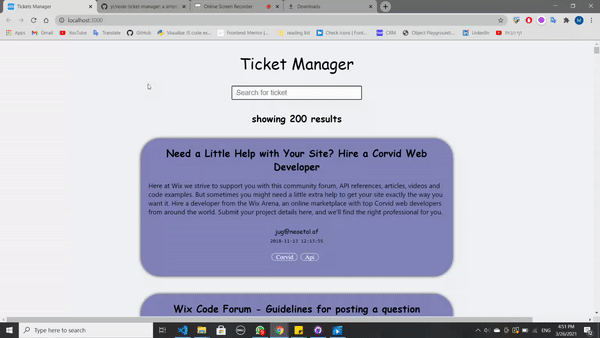
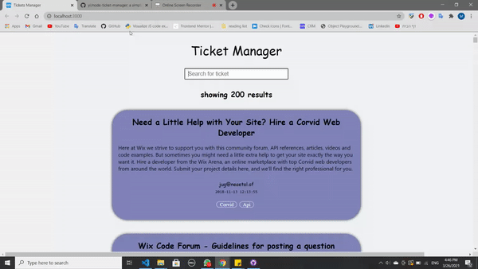

#  Wix Ticket Manager

In this project we create a Ticket Manager Web Application, with the [MERN stack](https://www.educative.io/edpresso/what-is-mern-stack)
We built This app as part of Cyber4s program monthly final project, and it include most of the topics we have learnt so far.

heruko link: https://ticketmanager-am.herokuapp.com/

## Tech used

- html
- css
- javaScript
- react
- axiox
- express
- mongoDb Atlas
- mongoose

## features

- search to filter results

  

- search results counter
- hide ticket on hover
- restore hidden tickets (only avilable if there are hidden tickets)
- hidden cards counter

  

- can update ticket as done/ undone with request api/tickets/[:ticketId/undone

## Install as NodeJS module:

Install the module with:

```bash
npm install
```
